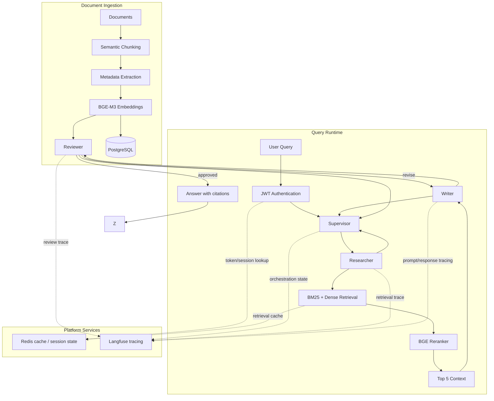

# RAG Multi-Agent System

FastAPI, LangGraph, BGE-M3, Postgres + pgvector, hybrid retrieval, BGE reranking, and token auth.

## Pipeline



## Setup

```bash
uv sync --dev
```

Create `.env`:

```bash
OPENROUTER_API_KEY=your_key
LANGFUSE_ENABLED=1
LANGFUSE_PUBLIC_KEY=your_langfuse_public_key
LANGFUSE_SECRET_KEY=your_langfuse_secret_key
# Optional runtime services
JWT_SECRET=your_hs256_secret
REDIS_URL=redis://localhost:6379/0
RETRIEVAL_CACHE_TTL_SECONDS=900
```

Build the retrieval index:

```bash
uv run python RAG/services/rag_service.py
```

Run the app:

```bash
uv run python RAG/app.py
```

Open `http://localhost:8000`.

## Notes

- `RAG/services/rag_service.py` builds `RAG/vector_db/corpus.jsonl` (BM25) and writes dense vectors into the Postgres `rag_chunks` table via `RAG/services/vector_store.py` (pgvector). Set `DATABASE_URL` to point at Postgres.
- `RAG/services/retrieval.py` merges BM25 and pgvector dense candidates, then reranks with `BAAI/bge-reranker-large`.
- If Postgres/pgvector or the reranker is unavailable, the app falls back gracefully to corpus/BM25 retrieval.
- Token authentication is enabled when `JWT_SECRET` is set. Reads stay anonymous; `@update` (editor write-back) requires a valid token from `POST /auth/login`. Users live in Postgres (`auth_users`); a bootstrap admin is seeded from `ADMIN_USERNAME`/`ADMIN_PASSWORD`. `ALLOW_INSECURE_DEV=1` treats everything as an authenticated admin for local development.
- Redis is optional. When `REDIS_URL` is missing or unavailable, session state and retrieval cache fall back to in-process memory.
- Langfuse is optional. When it is disabled or unavailable, traces are written under `RAG/traces`.
