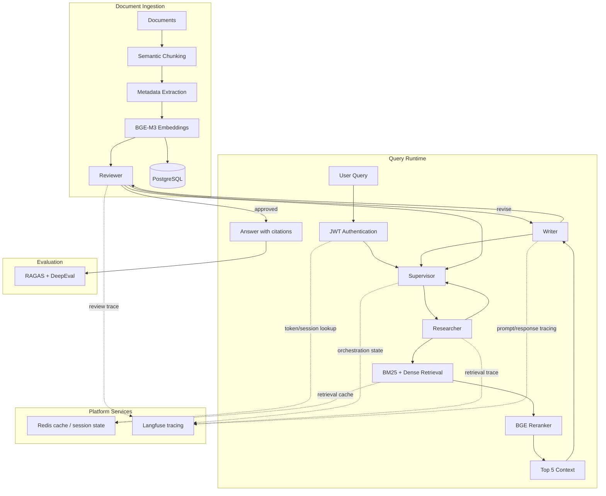

# RAG Multi-Agent System

FastAPI, LangGraph, BGE-M3, Qdrant, hybrid retrieval, BGE reranking, and optional RAGAS/DeepEval evaluation.

## Pipeline



## Setup

```bash
uv sync --dev
```

### One-command local run

```bash
./start.sh          # start Redis Stack + the app (frontend and API on one origin)
./start.sh status    # health check
./start.sh logs      # tail the app log
./start.sh stop      # stop the app (leaves the shared Redis container running)
```

Idempotent and safe to re-run — it reuses whatever's already up. Override the
port with `PORT=8091 ./start.sh`.

Create `.env`:

```bash
OPENROUTER_API_KEY=your_key
LANGFUSE_ENABLED=1
LANGFUSE_PUBLIC_KEY=your_langfuse_public_key
LANGFUSE_SECRET_KEY=your_langfuse_secret_key
# Optional runtime services
JWT_SECRET=your_hs256_secret
REDIS_URL=redis://localhost:6379/0
RETRIEVAL_CACHE_TTL_SECONDS=900
```

Build the retrieval index:

```bash
uv run python RAG/services/rag_service.py
```

Run the app:

```bash
uv run python RAG/app.py
```

Open `http://localhost:8000`.

## Notes

- `RAG/services/rag_service.py` builds `RAG/vector_db/corpus.jsonl` and a local Qdrant collection under `RAG/vector_db/qdrant`.
- `RAG/services/retrieval.py` merges BM25 and Qdrant dense candidates, then reranks with `BAAI/bge-reranker-large`.
- If Qdrant or the reranker is unavailable, the app falls back gracefully to corpus/BM25 retrieval.
- JWT authentication is enabled when `JWT_SECRET` is set. Without it, local development stays open.
- Redis is optional. When `REDIS_URL` is missing or unavailable, session state and retrieval cache fall back to in-process memory.
- Langfuse is optional. When it is disabled or unavailable, traces are written under `RAG/traces`.
